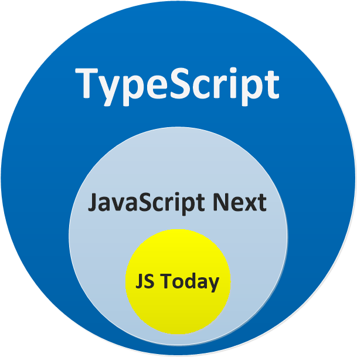

# *CORE TypeScript LEARNING*

> A beginner-friendly guide to TypeScript, designed to build a solid foundation for UI testing (e.g. using Playwright).
<p align="center">

</p>

---

## 📘 0. Interesting links
- [React Components For Creative Developers](https://reactbits.dev/)
- [Github: TypeScript Coding Guideline](https://github.com/Microsoft/TypeScript/wiki/Coding-guidelines#null-and-undefined)
## 📘 1. What is TypeScript?

- JavaScript is a **subset of TypeScript**. TypeScript adds *static checking* to JavaScript --> meaning that TS can detect errors in code without running it.
- It helps **catch errors early** and **makes code more readable and maintainable.**
- TypeScript *never* changes the runtime behavior of JavaScript code.
- TypeScript code is compiled into regular JavaScript to run in any browser or Node.js environment.

---

## 📘 2. Getting started with TypeScript
### 2.1 TypeScript compiler (tsc) 
 - We can install TypeScript Compiler via ```npm```
 - Use this code to install TypeScript Compiler (tsc) globally
 - Remember to install ```nodejs``` first

```bash
npm install -g typescript
```

### 2.2 TypeScript editor: VS Code

### 2.3 Types can be Explicit:
- TypeScript will infer as much as it can safely, meaning that TypeScript can guess data type based on the input
- Yet, we can also use ```: <data_type>``` annotation to declare data type like this:

```ts
var age: number = 25
```

- So if we do something wrong the compiler will report an error like this:
```ts
var age: number = '25' // Error: cannot assign a `string` to a `number`
```

### 2.4 Types can be Structural
- <span style="color: red;">Will come back to this later</span>
- 
```ts
interface Point {
  x: number;
  y: number;
}

function printPoint(p: Point) {
  console.log(p.x, p.y);
}

const myObj = {x: 10, y: 20, z: 30};
printPoint(myObj); // Works! Even though myObj is not explicitly a Point
```
---
## 📘 3. Basic Types & Data Types

### 3.1 <span style="color: green;">Hoisting</span>
- A mechanism in JavaScript where a variable can be used before it has been declared.
- This is a behavior of moving all declarations to the top of the current scope (to the top of the current script or the current function).
- <span style="color: purple;">Note:</span> it only moves the part where declaring variables, not setting values.

### 3.2 Three ways of Declaring Variables
#### a. ```var```

- <span style="color: red;">Scope</span>: limited in *function-scoped*
- <span style="color: red;">Hoisting</span> is enabled: easy to cause potential error because of this. For example:
```ts
function test() {
  console.log(a); // undefined
  var a = 5;
}
test();
```

#### b. ```let``` & ```const```
- <span style="color: red;">Scope</span>: limited in *block-scoped* --> exist within the block `{...}` where it is declared

```ts
function testLet() {
  if (true) {
    let y = 20;
  }
  console.log(y); // ❌ Error: y is not defined
}
```

- `let` allows us to change value of an existing variable but `const` does not
```ts
let name = "Alice";
name = "Bob"; // ✅ 
``` 
**Explanation**:
- `let`: declares a block-scoped variable.
- `age`: name of the variable.
- `:`: specifies the type of the variable.
- `number`: the type.
- `= 25`: assigns the value 25 to the variable.

### 3.3 Common Data Types
In TypeScript, we have some basic data types including: 

|| Type      | Syntax                | Example                      |
|-|-----------|-----------------------|------------------------------|
|1| number    | `let x: number`       | `let price = 100;`          |
|2| string    | `let s: string`       | `let name = "Alice";`       |
|3| boolean   | `let b: boolean`      | `let isReady = true;`       |
|4| array     | `let a: type[]`       | `let items: string[] = []`  |
|5| enum      | `enum a {v1 v2}`      | `enum Direction {up down}`  |
|6| void      | used to indicate a function has no  value to return | `function log(): void { console.log("hi") }`


#### 🔸 `any` type

```ts
let something: any;
something = 42;
something = "Hello";
something = true;
something = { name: "Alice" };
something = [1, 2, 3];
console.log(something);
```

- `any` disables all type checking --> It **bypasses** TypeScript’s static type system.
- Avoid using `any` in production code.

#### 🔸 `unknown` type

```ts
let dontKnow: unknown;
dontKnow = 42;
dontKnow = "Hello";
dontKnow = true;
dontKnow = { name: "Bob" };
dontKnow = [4, 5, 6];
console.log(dontKnow);
```

- `unknown` is safer than `any` because it forces to **narrow the type** before using it.
- TypeScript won’t let us access properties or call methods on `unknown` without type checks.

```ts
if (typeof dontKnow === "string") {
  console.log(dontKnow.toUpperCase()); // Safe
}
```

### 3.4 Enum Types
```ts
enum dayOfWeek {
  Monday = "Monday",
  Tuesday = "Tuesday",
  Wednesday = "Wednesday"
}
let day = dayOfWeek.Monday;
```

> - Enums provide a set of named constants.
> - Improve code readability and reduce hardcoded strings.

### 3.5 Arrays

#### 🔸 Typed Arrays

```ts
let numbers: number[] = [1, 2, 3, 4, 5];
let strings: string[] = ["one", "two", "three"];
let booleans: boolean[] = [true, false, true];
```

#### 🔸 Mixed-Type Arrays

```ts
let mixed: (number | string | boolean)[] = [1, "two", true, 3];
let mixedArray: any[] = [1, "two", true, { name: "Charlie" }, [5, 6, 7]];
```

- Union types maintain **type safety**.
- `any[]` disables type checking on the array elements.

#### 🔸 Type Inference

```ts
let numberInference = [1, 2, 3]; // number[]
let mixedInference = [1, "two", true]; // (number | string | boolean)[]
```

#### 🔸 `const` Arrays vs `readonly` Arrays

```ts
const constArray = [1, 2, 3];         // Mutable elements
constArray[0] = 10;                   // ✅ Allowed

const constReadOnlyArray: readonly number[] = [1, 2, 3];
// constReadOnlyArray[0] = 10;        // ❌ Error: readonly array
```

> ✅ Use `readonly` for truly immutable arrays in tests and shared data.

#### 💡 When do we use mixed arrays in testing?

In UI tests (e.g. form <u>validation</u>), inputs can be of mixed types:
```ts
const inputs: arrays[] = ["abc", 123, false];
```


### 3.6 Tuple Types

```ts
let userInfo: [string, number, boolean];
userInfo = ["Tony", 24, true];
// userInfo = [24, "Tony", true]; // ❌ Error
```

> - ✅ Tuples have fixed length and fixed types at each index.
> - ✅ Used for tightly coupled data (like database row: name, age, status).

---

### 3.7 Type Alias

#### 🧩 Defining custom data type
```ts
type Car = {
  name: string;
  model: string;
  powerHorse: number;
  isHybrid?: boolean;
};
```

> - Type aliases define reusable structures for objects.
> - Use `?` for optional fields.
> - Commonly used in API automation testing.

#### 🧩 Union & Intersection

```ts
type Addidas = { color: string };
type mixCarAddidas = Car & Addidas; // Intersection
type orType = Car | Addidas;        // Union
```

- `&`: must include both types.
- `|`: can be either.

---

### 3.8 Interface

```ts
interface CarInterface {
  name: string;
  model: string;
  powerHorse: number;
  isHybrid?: boolean;
}

interface AddidasInterface {
  color: string;
}
```

> - ✅ Similar to `type`, but extendable.
> - ✅ Preferable when working with classes.
> - ❌ Interfaces CANNOT DEFINE UNION TYPES.

---

### 3.9 Type Literals
- Used to restrict values to specific strings (like enum alternative).
```ts
type answer = "Yes" | "No" | "Maybe";
```

### 3.10 `never` type

#### 🔸 Functions that never return

```ts
function throwError(message: string): never {
  throw new Error(message);
}
```

- Used to represent a value that **should never occur**.
- Commonly used in error handling or infinite loops.

```ts
let myNever: never;
// myNever = 123; // ❌ Type error
```
> ✅ In UI testing, this is useful in strict utility helpers to ensure exhaustive type checking.

### 3.11 Spread Operator

```ts
let user3 = { name: "Alice", age: 30 };
let user4 = { ...user3, isEmployed: true };
```

- ✅ Useful for object cloning and merging.
- ⚠️ Later values override earlier ones.

---
## 📘 4. Number
> Whenever we are handling numbers in any programming language, we need to be aware of how the language handles numbers. 

A few critical pieces of information about `numbers` in JavaScript that we should be aware of.

## 4.1 Core Type
- JavaScript has only one number type. It is a double-precision 64-bit Number. 

- Meaning that, there are no seperate between `float` vs `double` vs `int` vs `long`

- Below we discuss its limitations along with a recommended solution.
## 4.2 Decimal / Floating Point Precision Issue
- Example:
```ts
0.1 + 0.2 = 0.30000000000000004
```
- While calculating money, rate, etc; we should use libraries like: `big.js` for precise decimal arithmetic

## 4.3 Integer limits
- The integer limits represented by the built in number type are `Number.MAX_SAFE_INTEGER` and `Number.MIN_SAFE_INTEGER`
```ts
console.log(Number.MAX_SAFE_INTEGER); // 9007199254740991
console.log(Number.MIN_SAFE_INTEGER); // -9007199254740991
```
- Past those bounds, addition/subtraction can break (“round off”).

- **Safe** in this context refers to the fact that the value cannot be the result of a rounding error.

- The **unsafe values** are `+1 / -1` away from these values any amount of addition / subtraction will round the result. For demonstration:
```ts
console.log(Number.MAX_SAFE_INTEGER + 1 === Number.MAX_SAFE_INTEGER + 2); // true!
console.log(Number.MIN_SAFE_INTEGER - 1 === Number.MIN_SAFE_INTEGER - 2); // true!

console.log(Number.MAX_SAFE_INTEGER);      // 9007199254740991
console.log(Number.MAX_SAFE_INTEGER + 1);  // 9007199254740992 - Correct
console.log(Number.MAX_SAFE_INTEGER + 2);  // 9007199254740992 - Rounded!
console.log(Number.MAX_SAFE_INTEGER + 3);  // 9007199254740994 - Rounded - correct by luck
console.log(Number.MAX_SAFE_INTEGER + 4);  // 9007199254740996 - Rounded!
```
## `big.js` library
Whenever we use math for financial calculations (e.g. GST calculation, money with cents, addition etc) use a library like big.js which is designed for
- Perfect decimal math
- Safe out of bound integer values

**Installation is simple:**
```ts
npm install big.js @types/big.js
```
**Quick Usage example:**
```ts
import { Big } from 'big.js';

export const foo = new Big('111.11111111111111111111');
export const bar = foo.plus(new Big('0.00000000000000000001'));

// To get a number:
const x: number = Number(bar.toString()); // Loses the precision
```
## 4.4 `NaN` (Not a Number)
- This happens when operations fail or are not representable. For example:
    - Square root of a negative number
    - Divided by 0
- **NOTE**: `NaN === NaN` is `false`; because `NaN` does not equal to itself.
- To check for NaN, do not use `Number.isNaN(x)`, instead, use this:
```ts
Number.isNaN()
```
## 4.5 Infinity and -Infinity
 Represent overflow / extremely large values.
- Beyond Number.MAX_VALUE → `Infinity`.
```ts
console.log(Number.POSITIVE_INFINITY); // Infinity
console.log(Number.NEGATIVE_INFINITY); // -Infinity

console.log( 1 / 0); // Infinity
console.log(-1 / 0); // -Infinity

console.log( Infinity >  1); // true
console.log(-Infinity < -1); // true
```
## 4.6 Infinitesimal / Tiny numbers
- `Number.MIN_VALUE` is the smallest positive non-zero number `(~5e‑324)`.
```ts
console.log(Number.MIN_VALUE);  // 5e-324
```
- If we receive values smaller than `MIN_VALUE` ---> underflow to `0`.
```ts
console.log(Number.MIN_VALUE / 10);  // 0
```
> Further intuition: Just like values bigger than `Number.MAX_VALUE` get clamped to INFINITY, values smaller than `Number.MIN_VALUE` get clamped to `0`.
---
## 📘 5. Equality (`==` vs `===`)

### 5.1 Loose Equality vs Strict Equality

| Operator | Name           | Type Coercion |
|----------|----------------|---------------|
| `==`     | Loose Equality | ✅ Yes         |
| `===`    | Strict Equality| ❌ No          |
| `!=`     | Loose Not Equal| ✅ Yes         |
| `!==`    | Strict Not Equal| ❌ No         |

Best practice:
- Should always use `===` and `!==`
- Avoid using `==` and `!=` except for verifying `null/undefined`

### 5.2 Examples

```ts
console.log(5 == "5");   // true   → type coercion ("5" becomes 5)
console.log(5 === "5");  // false  → different types (number vs string)

console.log("" == "0");  // false  → both are strings, but not equal
console.log(0 == "");    // true   → "" coerces to 0

console.log("" === "0"); // false  → both strings, but different
console.log(0 === "");   // false  → number vs string
```
---
## 📘 6. Reference types
### 6.1 Object
Object (including array, function, ...) is reference types, not value types.
```ts
var foo = {};
var bar = foo;  // bar trỏ cùng object với foo
```
- When we set `bar = foo`, we do not copy the object, but we copy the address to it --> bar is a reference to the same object.
- Therefore, `foo` and `bar` points to the same object in memory space
```ts
foo.baz = 123;
console.log(bar.baz);  // Output: 123
```
- If we change that object through `foo.baz = 123` then `bar` would change too.

> ==NOTE==: we do not have 2 objects, we just have two variables that points to the same object.

### 6.2 Equality is for references
```ts
var foo = {};
var bar = foo;   // bar = cùng object với foo
var baz = {};    // baz = object MỚI, khác với foo

console.log(foo === bar); // true (cùng tham chiếu)
console.log(foo === baz); // false (2 object khác nhau)
```

> ==REMEMBER==: Comparing object in JS is comparing references, not values !!! 
---
## 7. Null & Undefined
---> Useful Youtube video: https://www.youtube.com/watch?v=kaUfBNzuUAI
### 7.1 Definition
JavaScript (and by extension TypeScript) has two bottom types : `null` and `undefined`. They are intended to mean different things:

- Something hasn't been initialized : `undefined`. For example:
    - a variable that we have defined without setting value
    - function that returns nothing
- Something is currently unavailable: `null`
    - we use `null` when we want to declare a variable may have value, but not at the moment

### 7.2 How TypeScript / JavaScript treat them in comparison
```ts
// Both null and undefined are only `==` to themselves and each other:
console.log(null == null); // true (of course)
console.log(undefined == undefined); // true (of course)
console.log(null == undefined); // true

// You don't have to worry about falsy values making through this check
console.log(0 == undefined); // false
console.log('' == undefined); // false
console.log(false == undefined); // false
```
- Therefore, using `==` is recommended because it checks for both `null` or `undefined`
- For example,
```ts
function foo(arg: string | null | undefined) {
  if (arg != null) {
    // here, arg is NOT null and NOT undefined → must be string
  }
}
```

### 7.3 Checking for “root-level undefined” & referencing undeclared variables
- If we use variables that are not yet declaired (global-scoped) --> `ReferenceError`
    - E.x: `console.log(someGlobal)` while `someGlobal` is not yet imported or `var/let/const`
- So to check if a variable is defined or not at a global level you normally use `typeof`:
    ```ts
    if (typeof someGlobal !== 'undefined') {
      // someGlobal is now safe to use
      console.log(someglobal);
  }
    ```

### 7.4 Best practice: Avoid explicit use of `undefined` in Return Values
#### a. Functions that return `undefined` implicitly

In JavaScript/TypeScript, if a function has no `return` statement, it implicitly returns `undefined`.
```ts
function sayHello() {
  console.log("Hello");
}

const result = sayHello(); // prints "Hello"
console.log(result);       // 👉 undefined
```

#### b. Explicitly returning `undefined` in an object
```ts
function getUser() {
  return {
    name: "Alice",
    age: undefined  // 👈 explicit undefined
  }
}
```
This adds a property `age` with a value of `undefined`. But here's the problem:
- When <span style="color: red;">SERIALIZING</span> to JSON, the `undefined` property will be removed
- It can lead to inconsistent or confusing behavior in APIs

#### c. Better strategy: use Optional Properties `?`
We can simply **ignore** the property and use `?` (optional) in the return type like this:
```ts
function getUser(): { name: string; age?: number } {
  return {
    name: "Alice"
    // no age field at all
  };
}
```

### 7.5 Callback & Validation function
To be continued :)

---
## 8. Truthy
### 8.1 Definition
JavaScript has a concept of `truthy` i.e. 
- Things that evaluate like true would in certain positions (e.g. if conditions and the boolean `&&`, `||` operators). 
- An example is any number other than 0 e.g.

### 8.2 `truthy` & `falsy`
| Type     | `falsy`        | `truthy`      |
|----------|----------------|---------------|
| `boolean`| `false`        | `true`        |

| Type       | `falsy`            | `truthy` |
|------------|----------------|--------------- |
| `boolean`  | `false`        |`true`          |
| `string`   | Empty string   |Not empty string|
| `number`   |`0`, `NaN`      |Others number   |
| `null`     |Always `falsy`  |                |
| `undefined`|Always `falsy`  |                |
| `object`   |                |always `truthy` (even for empty `[],{}`)|

For example: 
```ts
if (123) { // Will be treated like `true`
  console.log('Any number other than 0 is truthy');
}
```
---
## 🛠 9. Functions
- Block of code that can take inputs (parameters), do work, return output.
- Can be named, anonymous, arrow.
- There are different ways of declaring functions: 

| Type                      | Syntax Example                                                                 | When to Use / Pros                                                                 | Cons / Caveats                                           |
|---------------------------|---------------------------------------------------------------------------------|--------------------------------------------------------------------------------------|-----------------------------------------------------------|
| **Function Declaration**  | `function add(a: number, b: number): number { return a + b; }`                  | Hoisted (can be used before it's defined), clean for main logic                  | ❌ Verbose for simple callbacks                           |
| **Function Expression**   | `const add = function(a: number, b: number): number { return a + b; };`        | Flexible, can be passed as arguments or assigned to variables                    | ❌ Not hoisted; anonymous functions are harder to debug   |
| **Arrow Function**        | `const add = (a: number, b: number): number => a + b;`                          | Short syntax, great for callbacks, `this`-safe (lexical `this`)                  | ❌ Not hoisted; no own `this`, `arguments`, or `super`    |

> 💡💡💡 
> Use **arrow functions** when working with UI event handlers, promises, or concise operations.  
> Use **declarations** when writing reusable named logic.  
> Use **expressions** for inline logic or when we want to assign a function to a variable.
### 9.1 Function concepts & Type Annotations
- Parameters / Arguments: We can declare
    - <span style="color: red;">data type</span>: We declare the data type of each parameter using `:` syntax.
      ```ts
        function greet(name: string, age: number): void {
          console.log(`Hello ${name}, you are ${age} years old.`);
        }
      ```
    - <span style ="color: red;">optional parameters</span>: using (`?`) annotation
      ```ts
        ⚠️⚠️⚠️ // Optional parameters must always come after required ones.
        function greet(name: string, age?: number): void {
          console.log(`Hello ${name}`);
          if (age !== undefined) {
            console.log(`You are ${age} years old.`);
            }
        }
      ```
    - <span style ="color: red;">default parameters</span>: providing a default value to a parameter. If the caller doesn’t supply the value, the default will be used.
    --> Hence, <u>default parameters</u> can be treated as <u>optional</u>, but with a fallback value.
      ```ts
        function greet(name: string = "Guest"): void {
          console.log(`Hello ${name}`);
        }

        greet();            // 👉 "Hello Guest"
        greet("Charlie");   // 👉 "Hello Charlie"
      ```
    - <span style ="color: red;">rest parameters</span>: when we want to accept multiple arguments and handle them as an array.
      ```ts
        function sum(...nums: number[]): number {
          return nums.reduce((acc, val) => acc + val, 0);
        }
        sum(1, 2, 3);       // 👉 6
        sum();              // 👉 0
      ```
       - Here `...nums` gathers all remaining arguments into an array of `numbers[]`.
       - <span style="color: red;">Only 1 rest parameter</span> is allowed per function, and it must come last.
- Return type: we can define the type of value that a function returns, after the parameter list, using `:` annotation.

**<u>COMBINING ALL CONCEPTS</u>**
```ts
function logInfo(name: string, age: number = 18, ...tags: string[]): string {
  return `${name}, Age: ${age}, Tags: ${tags.join(", ")}`;
}

logInfo("Sam");                            // "Sam, Age: 18, Tags: "
logInfo("Linh", 22, "student", "intern");  // "Linh, Age: 22, Tags: student, intern"
```

### 9.2 Function Declaration
- By doing this, the function will be declared before executed
- We should use this method
```ts
// Function Declaration
sayHi("John"); // Hello, John

function sayHi(name: string): string {
  alert( `Hello, ${name}` );
}
```
Explanation:
- `name: string`: parameter `name` must be a string.
- `: string`: return type of the function.

### 9.3 Function Expression
- A function created within another syntax
- It won't work if we put it like this
```ts
// Function Expression
sum(1,2) // error!
let sum = function(a, b) {
  return a + b;
};
```

### 9.4 Arrow Function
- This one usually goes well with Function Expression
```ts
// Instead of coding like this
let func = function(arg1, arg2, ...argN) {
  return expression;
};
// We can do like this, which is much shorter
let func = (arg1, arg2, ...argN) => expression
```
- In some cases where there is only one parameter, we can ommit the `()`, which is conveniently short:
```ts
// let double = function(n) { return n * 2 }
let double = n => n * 2;
alert( double(3) ); // 6
```
- Reference: 
    - [Arrow Function](https://basarat.gitbook.io/typescript/future-javascript/arrow-functions)
    - [Arrow Function - VN](https://techmaster.vn/posts/35067/javascript-can-ban-function-va-arrow-function)

```ts
const add = (a: number, b: number): number => {
  return a + b;
};
```

---

## 📦 10. Interfaces and Types

### ✅ Interface

```ts
interface User {
  id: number;
  name: string;
  active: boolean;
}
```

- An interface defines the **shape of an object**.

### ✅ Type alias

```ts
type Status = "active" | "inactive";
```

### 🔍 Interface vs Type

| Feature       | Interface | Type     |
|---------------|-----------|----------|
| Objects       | ✅        | ✅       |
| Unions/Literals | ❌      | ✅       |
| Extendable    | ✅        | ❌       |

---

## 🧱 5. Classes (used in Page Object Model)

```ts
class LoginPage {
  constructor(private page: Page) {}

  async login(username: string, password: string) {
    await this.page.fill("#username", username);
    await this.page.fill("#password", password);
    await this.page.click("button[type='submit']");
  }
}
```

- `class`: declares a class.
- `constructor`: runs when the object is created.
- `private page`: class property only accessible inside the class.

---

## 🔄 6. Modules (Import / Export)

```ts
// utils.ts
export function getId(): string {
  return crypto.randomUUID();
}

// index.ts
import { getId } from "./utils";
```

- You can export and import code between files using ES Modules.

---

## 🔍 7. Type Inference & Assertion

### ✅ Type Inference

```ts
let count = 10; // inferred as number
```

### ✅ Type Assertion

```ts
let input = document.querySelector("#email") as HTMLInputElement;
input.value = "test@example.com";
```

Use this only when you're **100% sure** of the type.

---

## ⚙ 8. tsconfig.json – Compiler Settings

```json
{
  "compilerOptions": {
    "target": "ES2020",
    "strict": true,
    "esModuleInterop": true
  }
}
```

| Option           | Description                                |
|------------------|--------------------------------------------|
| `target`         | JS version to compile to                   |
| `strict`         | Enables strict type checking               |
| `esModuleInterop`| Allows compatibility with CommonJS modules |

---

## 💡 9. Real-World Use Case: Mock Data Generator

```ts
interface User {
  id: string;
  name: string;
  active: boolean;
}

function createMockUser(): User {
  return {
    id: crypto.randomUUID(),
    name: "Jane Doe",
    active: Math.random() > 0.5
  };
}
```

---

## ✅ Summary

- Learn TypeScript step by step, starting with data types, functions, interfaces, and classes.
- Use `ts-node` or `Code Runner` to test code in `index.ts`.
- Apply what you learn in real-world projects like mock data generators or Playwright UI testing.

