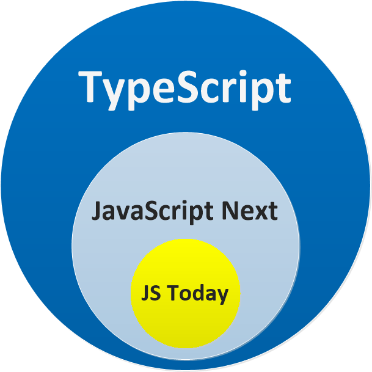

# _CORE TypeScript LEARNING_
> A beginner-friendly guide to TypeScript, designed to build a solid foundation for UI testing (e.g. using Playwright).
<p align="center">

</p>

---
# 📑 Table of Contents
- [0. Interesting links](#-0-interesting-links)
- [1. What is TypeScript?](#-1-what-is-typescript)
- [2. Getting started with TypeScript](#-2-getting-started-with-typescript)
  - [2.1 TypeScript compiler (tsc)](#21-typescript-compiler-tsc)
  - [2.2 TypeScript editor: VS Code](#22-typescript-editor-vs-code)
  - [2.3 Types can be Explicit](#23-types-can-be-explicit)
  - [2.4 How to init a project using TypeScript?](#24-how-to-init-a-project-using-typescript)
  - [2.5 How to run a TypeScript file?](#25-how-to-run-a-typescript-file)
- [3. Basic Types & Data Types](#-3-basic-types--data-types)
  - [3.1 Hoisting](#31-hoisting)
  - [3.2 Three ways of Declaring Variables](#32-three-ways-of-declaring-variables)
  - [3.3 Common Data Types](#33-common-data-types)
  - [3.4 Enum Types](#34-enum-types)
  - [3.5 Arrays](#35-arrays)
  - [3.6 Tuple Types](#36-tuple-types)
  - [3.7 never type](#37-never-type)
  - [3.8 Spread Operator](#38-spread-operator)
- [4. Date](#4-date)
- [5. Number (nice to know)](#-5-number-nice-to-know)
  - [5.1 Core Type](#51-core-type)
  - [5.2 Decimal / Floating Point Precision Issue](#52-decimal--floating-point-precision-issue)
  - [5.3 Integer limits](#53-integer-limits)
  - [big.js library](#bigjs-library)
  - [5.4 NaN (Not a Number)](#54-nan-not-a-number)
  - [5.5 Infinity and -Infinity](#55-infinity-and--infinity)
  - [5.6 Infinitesimal / Tiny numbers](#56-infinitesimal--tiny-numbers)
- [6. Equality operator (`==` vs `===`)](#-6-equality-operator--vs-)
  - [6.1 Loose Equality vs Strict Equality](#61-loose-equality-vs-strict-equality)
  - [6.2 Examples](#62-examples)
- [7. Reference types](#-7-reference-data-types)
  - [7.1 Object](#71-object)
  - [7.2 Equality is for references](#72-equality-is-for-references)
- [8. Null & Undefined](#-8-null--undefined)
  - [8.1 Definition](#81-definition)
  - [8.2 How to check null | undefined](#82-how-to-check-null-or-undefined)
  - [8.3 Usage of `typeof`](#83-usage-of-typeof)
  - [8.4 Best practice: Avoid explicit use of undefined in Return Values](#84-best-practice-avoid-explicit-use-of-undefined-in-return-values)
  - [8.5 Callback & Validation function](#85-callback--validation-function)
- [9. Truthy](#-9-truthy)
  - [9.1 Definition](#91-definition)
  - [9.2 truthy & falsy](#92-truthy--falsy)
- [10. Functions](#-10-functions)
  - [10.1 Function concepts & Type Annotations](#101-function-concepts--type-annotations)
  - [10.2 Function Declaration](#102-function-declaration)
  - [10.3 Function Expression](#103-function-expression)
  - [10.4 Arrow Function](#104-arrow-function)
  - [10.5 Anonymous Function](#105-anonymous-function)
- [11. Class vs Interface vs Type Alias](#-11-classclass-vs-interface-vs-type-alias)
  - [11.1 type Alias](#111-type-alias)
  - [11.2 interface](#112-interface)
  - [11.3 class](#113-class)
= [12. ]()
---

## 📘 0. Interesting links

- [React Components For Creative Developers](https://reactbits.dev/)
- [TypeScript: Documentation](https://www.typescriptlang.org/docs/handbook/2/everyday-types.html)
- [TypeScript practice challenges](https://github.com/type-challenges/type-challenges/tree/main/questions)

## 📘 1. What is TypeScript?

- JavaScript is a **subset of TypeScript**. TypeScript adds _static checking_ to JavaScript --> meaning that TS can detect errors in code without running it.
- It helps **catch errors early** and **makes code more readable and maintainable.**
- TypeScript _never_ changes the runtime behavior of JavaScript code.
- TypeScript code is compiled into regular JavaScript to run in any browser or Node.js environment.

---

## 📘 2. Getting started with TypeScript
- Before that, remmember to install `ts-node` to run TypeScript directly
```bash
npm install ts-node typescript @types/node --save-dev
```

### 2.1 TypeScript compiler (tsc)
- Check if you have installed `nodejs` first
```bash
node -v
```
- We can install TypeScript Compiler via `npm`
- Use this code to install TypeScript Compiler (tsc) globally

```bash
npm install -g typescript
```
- Verify TypeScript compiler installation
```bash
tsc -v
```

### 2.2 TypeScript editor: VS Code

### 2.3 Types can be Explicit:

- TypeScript will infer as much as it can safely, meaning that TypeScript can guess data type based on the input
- Yet, we can also use `: <data_type>` annotation to declare data type like this:

```ts
  var age: number = 25;
```

- So if we do something wrong the compiler will report an error like this:

```ts
  var age: number = "25"; // Error: cannot assign a `string` to a `number`
```
---

### 2.4 How to init a project using TypeScript?

- A TypeScript project usually has 3 main parts:
  1. `package.json` -> manages dependencies and scripts
  2. `tsconfig.json` -> tells the TypeScript compiler how to compile your code
  3. `src/` folder -> contains your `.ts` source files

#### Step 1: Create a new folder

```bash
mkdir my-typescript-project
cd my-typescript-project
```

#### Step 2: Initialize a Node.js project

```bash
npm init -y
```

This creates a `package.json` file.

#### Step 3: Install TypeScript and useful tools

```bash
npm install --save-dev typescript ts-node @types/node
```

- `typescript`: the TypeScript compiler
- `ts-node`: runs TypeScript files directly
- `@types/node`: gives TypeScript type definitions for Node.js

#### Step 4: Create a TypeScript config file

```bash
npx tsc --init
```

This creates a `tsconfig.json` file. You can adjust it later based on your needs.

#### Step 5: Create your first TypeScript file

Create a folder named `src` and a file inside it:

```bash
mkdir src
```

```ts
// src/index.ts
console.log("Hello TypeScript!");
```

#### Step 6: Add scripts to package.json

Open `package.json` and add scripts like this:

```json
"scripts": {
  "start": "ts-node src/index.ts",
  "build": "tsc"
}
```

#### Step 7: Run the project

```bash
npm start
```

This runs your TypeScript file directly.

To compile it into JavaScript:

```bash
npm run build
```

#### Example project structure

```text
my-typescript-project/
├── package.json
├── tsconfig.json
└── src/
    └── index.ts
```

### 2.5. How to run a TypeScript file?

- There are two common ways to run TypeScript code:
  1. Run it directly with `ts-node` for quick testing
  2. Compile it to JavaScript with `tsc` for a more production-like workflow

#### Option 1: Run directly with ts-node

But make sure the terminal path is correct
Use this for learning / debugging / or fast prototyping:

```bash
npx ts-node src/index.ts
```
#### Option 2: Compile to JavaScript first

If you want to build your project properly, first compile it:

```bash
npx tsc
```

Then run the generated JavaScript file:

```bash
node dist/index.js
```

> In this project, the scripts are already set up in `package.json` to help with this workflow:

```json
"scripts": {
  "start": "ts-node src/index.ts",
  "build": "tsc"
}
```

#### Best practice

- Use `ts-node` for quick development and testing.
- Use `tsc` when you want to build and run the final version of your project.
- Keep your TypeScript files inside the `src` folder and write clean, typed code.

#### Example

```ts
// src/index.ts
const message: string = "Hello from TypeScript!";
console.log(message);
```

Run it with:

```bash
npm start
```

## 📘 3. Basic Types & Data Types

TypeScript divides data to 2 types:
  - Primitives (passed by value): `string`, `number`, `boolean`, `null`, `undefined`, etc
  - References (passed by refernece): reach out to section [7. Reference types](#-7-reference-data-types)

### 3.1 <span style="color: green;">Hoisting</span>

- A mechanism in JavaScript where a variable can be used before it has been declared.
- This is a behavior of moving all declarations to the top of the current scope (to the top of the current script or the current function).
- <span style="color: purple;">Note:</span> it only moves the part where declaring variables, not setting values.

### 3.2 Three ways of Declaring Variables

#### a. `var`

- <span style="color: red;">Scope</span>: limited in _function-scoped_
- <span style="color: red;">Hoisting</span> is enabled: easy to cause potential error because of this. For example:

```ts
  function test() {
    console.log(a); // undefined
    var a = 5;
  }
  test();
```

#### b. `let` & `const`

- <span style="color: red;">Scope</span>: limited in _block-scoped_ --> exist within the block `{...}` where it is declared

```ts
  function testLet() {
    if (true) {
      let y = 20;
    }
    console.log(y); // ❌ Error: y is not defined
  }
```

- `let` allows us to change value of an existing variable but `const` does not

```ts
  let name = "Alice";
  name = "Bob"; // ✅
```

**Explanation**:

- `let`: declares a block-scoped variable.
- `age`: name of the variable.
- `:`: specifies the type of the variable.
- `number`: the type.
- `= 25`: assigns the value 25 to the variable.

### 3.3 Common Data Types

In TypeScript, we have some basic data types including:

|     | Type    | Syntax                                             | Example                                      |
| --- | ------- | -------------------------------------------------- | -------------------------------------------- |
| 1   | number  | `let x: number`                                    | `let price = 100;`                           |
| 2   | string  | `let s: string`                                    | `let name = "Alice";`                        |
| 3   | boolean | `let b: boolean`                                   | `let isReady = true;`                        |
| 4   | array   | `let a: type[]`                                    | `let items: string[] = []`                   |
| 5   | enum    | `enum a {v1 v2}`                                   | `enum Direction {up down}`                   |
| 6   | void    | used to indicate a function has no value to return | `function log(): void { console.log("hi") }` |

#### 🔸 `any` type

```ts
  let something: any;
  something = 42;
  something = "Hello";
  something = true;
  something = { name: "Alice" };
  something = [1, 2, 3];
  console.log(something);
```

- `any` disables all type checking --> It **bypasses** TypeScript’s static type system.
- Avoid using `any` in production code.

#### 🔸 `unknown` type

```ts
  let dontKnow: unknown;
  dontKnow = 42;
  dontKnow = "Hello";
  dontKnow = true;
  dontKnow = { name: "Bob" };
  dontKnow = [4, 5, 6];
  console.log(dontKnow);
```

- `unknown` is safer than `any` because it forces to **narrow the type** before using it.
- TypeScript won’t let us access properties or call methods on `unknown` without type checks.
- To perform actions on an unknown variable, we must safely prove its type first using one of these methods:

```ts
  if (typeof dontKnow === "string") {
    console.log(dontKnow.toUpperCase()); // allowed to perform
  }
```

```ts
  if (dontKnow instanceof Date) {
    console.log(dontKnow.toISOString()); // allowed to perform
  }
```

### 3.4 Enum Types
> - Enums provide a set of named constants.
> - Improve code readability and reduce hardcoded strings.
```ts
  enum dayOfWeek {
    Monday = "Monday",
    Tuesday = "Tuesday",
    Wednesday = "Wednesday",
  }
  let day = dayOfWeek.Monday;
```

### 3.5 Arrays

#### 🔸 Typed Arrays

```ts
  let numbers: number[] = [1, 2, 3, 4, 5];
  let strings: string[] = ["one", "two", "three"];
  let booleans: boolean[] = [true, false, true];
```

#### 🔸 Mixed-Type Arrays

```ts
  let mixed: (number | string | boolean)[] = [1, "two", true, 3];
  let mixedArray: any[] = [1, "two", true, { name: "Charlie" }, [5, 6, 7]];
```

- Union types maintain **type safety**.
- `any[]` disables type checking on the array elements.

#### 🔸 Type Inference

```ts
  let numberInference = [1, 2, 3]; // number[]
  let mixedInference = [1, "two", true]; // (number | string | boolean)[]
```

#### 🔸 `const` Arrays vs `readonly` Arrays

```ts
  const constArray = [1, 2, 3]; // Mutable elements
  constArray[0] = 10; // ✅ Allowed

  const constReadOnlyArray: readonly number[] = [1, 2, 3];
// constReadOnlyArray[0] = 10;        // ❌ Error: readonly array
```

> ✅ Use `readonly` for truly immutable arrays in tests and shared data.

#### 💡 When do we use mixed arrays in testing?

In UI tests (e.g. form <u>validation</u>), inputs can be of mixed types:

```ts
  const inputs: arrays[] = ["abc", 123, false];
```

### 3.6 Tuple Types
- Tuple is a special type of array
- It's an array with fixed number of elements
- Each element has a known and specific data type
```ts
  let userInfo: [string, number, boolean];
  userInfo = ["Tony", 24, true];
  // userInfo = [24, "Tony", true]; // ❌ Error
```

> - ✅ Tuples have fixed length and fixed types at each index.
> - ✅ Used for tightly coupled data (like database row: name, age, status).

---

### 3.7 `never` type

#### 🔸 Functions that never return

```ts
  function throwError(message: string): never {
    throw new Error(message);
  }
```

- Used to represent a value that **should never occur**.
- Commonly used in error handling or infinite loops.

```ts
  let myNever: never;
  // myNever = 123; // ❌ Type error
```

> ✅ In UI testing, this is useful in strict utility helpers to ensure exhaustive type checking.

### 3.8 Spread Operator

```ts
  let user3 = { name: "Alice", age: 30 };
  let user4 = { ...user3, isEmployed: true };
```

- ✅ Useful for object cloning and merging.
- ⚠️ Later values override earlier ones.

---

## 4. Date

- Reference:
  - [MDN - Date - JavaScript](https://developer.mozilla.org/en-US/docs/Web/JavaScript/Reference/Global_Objects/Date)
  - [W3W Schools - Date - JavaScript](https://www.w3schools.com/js/js_dates.asp)
- Times and dates are handled using the built-in `Date` object. This object represents a specific moment in time, measured in millisecond since 01/01/1970 (the **epoch**)

```ts
const now: Date = new Date(); // 2025-09-28T10:43:34.342Z
```

| Method                 | Output example                   |
| ---------------------- | -------------------------------- |
| `getFullYear()`        | `2025`                           |
| `getMonth()`           | `8` (which is September)         |
| `getDate()`            | `25`                             |
| `getDay()`             | `4`                              |
| `toISOString()`        | `"2025-09-25T14:00:00.000Z"`     |
| `toLocaleDateString()` | `"9/25/2025"` (computers format) |

## 📘 5. Number (nice to know)

> Whenever we are handling numbers in any programming language, we need to be aware of how the language handles numbers.

A few critical pieces of information about `numbers` in JavaScript that we should be aware of.

## 5.1 Core Type

- JavaScript has only one number type. It is a double-precision 64-bit Number.

- Meaning that, there are no seperate between `float` vs `double` vs `int` vs `long`

- Below we discuss its limitations along with a recommended solution.

## 5.2 Decimal / Floating Point Precision Issue

- Example:

```ts
  0.1 + 0.2 = 0.30000000000000004
```

- While calculating money, rate, etc; we should use libraries like: `big.js` for precise decimal arithmetic

## 5.3 Integer limits

- The integer limits represented by the built in number type are `Number.MAX_SAFE_INTEGER` and `Number.MIN_SAFE_INTEGER`

```ts
  console.log(Number.MAX_SAFE_INTEGER); // 9007199254740991
  console.log(Number.MIN_SAFE_INTEGER); // -9007199254740991
```

- Past those bounds, addition/subtraction can break (“round off”).

- **Safe** in this context refers to the fact that the value cannot be the result of a rounding error.

- The **unsafe values** are `+1 / -1` away from these values any amount of addition / subtraction will round the result. For demonstration:

```ts
  console.log(Number.MAX_SAFE_INTEGER + 1 === Number.MAX_SAFE_INTEGER + 2); // true!
  console.log(Number.MIN_SAFE_INTEGER - 1 === Number.MIN_SAFE_INTEGER - 2); // true!

  console.log(Number.MAX_SAFE_INTEGER); // 9007199254740991
  console.log(Number.MAX_SAFE_INTEGER + 1); // 9007199254740992 - Correct
  console.log(Number.MAX_SAFE_INTEGER + 2); // 9007199254740992 - Rounded!
  console.log(Number.MAX_SAFE_INTEGER + 3); // 9007199254740994 - Rounded - correct by luck
  console.log(Number.MAX_SAFE_INTEGER + 4); // 9007199254740996 - Rounded!
```

## `big.js` library

Whenever we use math for financial calculations (e.g. GST calculation, money with cents, addition etc) use a library like big.js which is designed for

- Perfect decimal math
- Safe out of bound integer values

**Installation is simple:**

```ts
  npm install big.js @types/big.js
```

**Quick Usage example:**

```ts
  import { Big } from "big.js";

  export const foo = new Big("111.11111111111111111111");
  export const bar = foo.plus(new Big("0.00000000000000000001"));

// To get a number:
  const x: number = Number(bar.toString()); // Loses the precision
```

## 5.4 `NaN` (Not a Number)

- This happens when operations fail or are not representable. For example:
  - Square root of a negative number
  - Divided by 0
- **NOTE**: `NaN === NaN` is `false`; because `NaN` does not equal to itself.
- To check for NaN, do not use `Number.isNaN(x)`, instead, use this:

```ts
  Number.isNaN();
```

## 5.5 Infinity and -Infinity

Represent overflow / extremely large values.

- Beyond Number.MAX_VALUE → `Infinity`.

```ts
  console.log(Number.POSITIVE_INFINITY); // Infinity
  console.log(Number.NEGATIVE_INFINITY); // -Infinity

  console.log(1 / 0); // Infinity
  console.log(-1 / 0); // -Infinity

  console.log(Infinity > 1); // true
  console.log(-Infinity < -1); // true
```

## 5.6 Infinitesimal / Tiny numbers

- `Number.MIN_VALUE` is the smallest positive non-zero number `(~5e‑324)`.

```ts
  console.log(Number.MIN_VALUE); // 5e-324
```

- If we receive values smaller than `MIN_VALUE` ---> underflow to `0`.

```ts
  console.log(Number.MIN_VALUE / 10); // 0
```

> Further intuition: Just like values bigger than `Number.MAX_VALUE` get clamped to INFINITY, values smaller than `Number.MIN_VALUE` get clamped to `0`.

---

## 📘 6. Equality operator (`==` vs `===`)

### 6.1 Loose Equality vs Strict Equality

- "Type Coercion" --> implicit conversion of a value from this data type to another data type.
| Operator | Name             | Type Coercion |
| -------- | ---------------- | ------------- |
| `==`     | Loose Equality   | ✅ Yes        |
| `===`    | Strict Equality  | ❌ No         |
| `!=`     | Loose Not Equal  | ✅ Yes        |
| `!==`    | Strict Not Equal | ❌ No         |

Best practice:

- Should always use `===` and `!==`
- Avoid using `==` and `!=` except for verifying `null/undefined`

### 6.2 Examples

```ts
  console.log(5 == "5"); // true   → type coercion ("5" becomes 5)
  console.log(5 === "5"); // false  → different types (number vs string)

  console.log("" == "0"); // false  → both are strings, but not equal
  console.log(0 == ""); // true   → "" coerces to 0

  console.log("" === "0"); // false  → both strings, but different
  console.log(0 === ""); // false  → number vs string
```

---

## 📘 7. Reference data types
Examples of Reference Types: `object`, `Array`, `Function` and custom `class` instances

### 7.1 Object

Object (including array, function, ...) is reference types, not value types.

```ts
// Changing user2 will modify user1 because they reference the same object
let user1 = { name: "Alice" };
let user2 = user1; 

user2.name = "Bob";
console.log(user1.name); // Output: "Bob"
```

- When we set `user2.name = "Bob"`, we do not copy the object, but we copy the address to it 
- Therefore, `user1` and `user2` points to the same object in memory space

> ==NOTE==: we do not have 2 objects, we just have two variables that points to the same object.

### 7.2 Equality is for references
- Trong JS/TS, so sánh object bản chất là so sánh địa chỉ ô nhớ (references), chứ không so sánh giá trị bên trong.
```ts
// Analogy: xem object là một căn nhà. Khi so sánh:
const nha_A = { so_phong: 3 };
const nha_B = { so_phong: 3 };
// Value: cả hai nhà đều giống nhau (có 3 phòng) nhưng về reference thì hai ngôi nhà có địa chỉ khác nhau
```

```ts
  var foo = {};
  var bar = foo; // bar = cùng object với foo
  var baz = {}; // baz = object MỚI, khác với foo

  console.log(foo === bar); // true (cùng tham chiếu): Hai biến trỏ chung một vùng nhớ
  console.log(foo === baz); // false (2 object khác nhau):  Hai object nội dung giống nhau nhưng khác vùng nhớ
```

> ==REMEMBER==: Comparing object in JS is comparing references, not values !

---

## 8. Null & Undefined

---> Useful Youtube video: https://www.youtube.com/watch?v=kaUfBNzuUAI

### 8.1 Definition

JavaScript (and by extension TypeScript) has two bottom types : `null` and `undefined`. They are intended to mean different things:

- Something hasn't been initialized : `undefined`. For example:
  - a variable that we have defined without setting value
  - function that returns nothing
- Something is currently unavailable: `null`
  - we use `null` when we want to declare a variable may have value, but not at the moment

### 8.2 How to check `null` or `undefined`

```ts
// Both null and undefined are only `==` to themselves and each other:
console.log(null == null); // true (of course)
console.log(undefined == undefined); // true (of course)
console.log(null == undefined); // true

// You don't have to worry about falsy values making through this check
console.log(0 == undefined); // false
console.log("" == undefined); // false
console.log(false == undefined); // false
```

> Hence, using `== null` (loose equality) is recommended because it checks for both `null`and `undefined` at the same time (because `null == undefined`)
- For example,

```ts
  function foo(arg: string | null | undefined) {
    if (arg != null) {
      // here, arg is NOT null and NOT undefined → must be string
    }
  }
```

### 8.3 Usage of `typeof` 

- We use `typeof` to check for “root-level undefined” & referencing undeclared variables, meaning that:
  - If we use variables that are not yet declaired (global-scoped) --> `ReferenceError`
    - E.x: `console.log(someGlobal)` while `someGlobal` is not yet imported or `var/let/const`
  - So to check if a variable is defined or not at a global level we normally use `typeof`:
    ```ts
      if (typeof someGlobal !== "undefined") {
        // someGlobal is now safe to use
        console.log(someglobal);
      }
    ```
-  ⚠️❗ `typeof` is only used for checking undefined, not suitable to check null because `typeof null` will return `object`

    | Variable to check   | Code               | Output      |
    |---------------------|--------------------|-------------|
    | `undefined`         | `typeof undefined` | `undefined` |
    | Undeclared variable | `typeof something` | `undefined` |
    | `null`              | `typeof null`      | `object`    |

### 8.4 Best practice: Avoid explicit use of `undefined` in Return Values

- JavaScript/TypeScript in general, every `function` always return something, either it is returned implicitly or explicitly

#### a. Functions that return `undefined` implicitly

- If a function has no `return` statement, it implicitly returns `undefined`. 
- This kind of function is for execution purpose

```ts
  function sayHello() {
    console.log("Hello");
    // then JS/TS automatically add this code of line: 
    // return undefined;
  }
  const result = sayHello(); // prints "Hello"
  console.log(result); // 👉 undefined
```

> Explanation: `sayHello()` is called and executed --> "Hello" is printed out. Then function returns `undefined` implicitly --> `undefined` get stored into `result` variable.

#### b. Explicitly returning `undefined` in an object

```ts
  function getUser() {
    return {
      name: "Alice",
      age: undefined, // 👈 explicit undefined
    };
  }
```

This adds a property `age` with a value of `undefined`. But here's the problem:

- When <span style="color: red;">SERIALIZING</span> to JSON, the `undefined` property will be removed <--- Because `undefined` type does not exist in `JSON`

```ts
const user = getUser();
const jsonString = JSON.stringify(user);
console.log(jsonString); // 👉 {"name":"Alice"}
```

- It can lead to inconsistent or confusing behavior in APIs

#### c. A better strategy: using Optional Properties `?`

We can simply **ignore** the property and use `?` (optional) in the return type like this:

```ts
  function getUser(): { name: string; age?: number } {
    return {
      name: "Alice",
      // no need to use `age` field at all
    };
  }
```

- Writing `age?: number` is the same as writing `age: number | undefined`

### 8.5 Callback & Validation function

To be continued :)

---

## 9. Truthy

### 9.1 Definition

JavaScript has a concept of `truthy` i.e.

- Things that evaluate like true would in certain positions (e.g. if conditions and the boolean `&&`, `||` operators).
- An example is any number other than 0 e.g.

### 9.2 `truthy` & `falsy`

- Reference: [MDN - Truthy - Falsy](https://developer.mozilla.org/en-US/docs/Glossary/Falsy)

| Type      | `falsy` | `truthy` |
| --------- | ------- | -------- |
| `boolean` | `false` | `true`   |

| Type        | `falsy`               | `truthy`                                 |
| ----------- | --------------------- | ---------------------------------------- |
| `boolean`   | `false`               | `true`                                   |
| `string`    | Empty string ('', "") | Not empty string                         |
| `number`    | `0`, `NaN`, `-0`      | Others number                            |
| `null`      | Always `falsy`        |                                          |
| `undefined` | Always `falsy`        |                                          |
| `object`    |                       | always `truthy` (even for empty `[],{}`) |

For example:

```ts
  if (123) {
    // Will be treated like `true`
    console.log("Any number other than 0 is truthy");
  }
```

---

## 🛠 10. Functions
- Block of code that can take inputs (parameters), do work, return output.
- Can be named, anonymous, arrow.
- There are different ways of declaring functions:

| Type                     | Syntax Example                                                          | When to Use / Pros                                              | Cons / Caveats                                          |
| ------------------------ | ----------------------------------------------------------------------- | --------------------------------------------------------------- | ------------------------------------------------------- |
| **Function Declaration** | `function add(a: number, b: number): number { return a + b; }`          | Hoisted (can be used before it's defined), clean for main logic | ❌ Verbose for simple callbacks                         |
| **Function Expression**  | `const add = function(a: number, b: number): number { return a + b; };` | Flexible, can be passed as arguments or assigned to variables   | ❌ Not hoisted; anonymous functions are harder to debug |
| **Arrow Function**       | `const add = (a: number, b: number): number => a + b;`                  | Short syntax, great for callbacks, `this`-safe (lexical `this`) | ❌ Not hoisted; no own `this`, `arguments`, or `super`  |

> 💡💡💡

> Use **arrow functions** when working with UI event handlers, promises, or concise operations.  
> Use **declarations** when writing reusable named logic.  
> Use **expressions** for inline logic or when we want to assign a function to a variable.

### 10.1 Function concepts & Type Annotations
- How to write `function`? --> two parts: parameters + return type (return type can be omitted) due to the ability of inference in TypeScript. 

- Parameters / Arguments: We can declare

  - <span style="color: red;">data type</span>: We declare the data type of each parameter using `:` syntax.
    ```ts
      function greet(name: string, age: number): void {
        console.log(`Hello ${name}, you are ${age} years old.`);
      }
    ```
  - <span style ="color: red;">optional parameters</span>: using (`?`) annotation
    ```ts
        ⚠️⚠️⚠️ // Optional parameters must always come after required ones.
        function greet(name: string, age?: number): void {
          console.log(`Hello ${name}`);
          if (age !== undefined) {
            console.log(`You are ${age} years old.`);
            }
        }
    ```
  - <span style ="color: red;">default parameters</span>: providing a default value to a parameter. If the caller doesn’t supply the value, the default will be used.
    --> Hence, <u>default parameters</u> can be treated as <u>optional</u>, but with a fallback value.

    ```ts
      function greet(name: string = "Guest"): void {
        console.log(`Hello ${name}`);
      }

      greet(); // 👉 "Hello Guest"
      greet("Charlie"); // 👉 "Hello Charlie"
    ```

    UI use case example: Used to return a fallback avatar image when `size` is not specified.

    ```ts
      function getAvatarUrl(userId: string, size: number = 50): string {
        return `https://api.adorable.io/avatars/${size}/${userId}.png`;
      }
    ```

  - <span style ="color: red;">rest parameters</span>: when we want to accept multiple arguments and handle them as an array.
    ```ts
      function sum(...nums: number[]): number {
        return nums.reduce((acc, val) => acc + val, 0);
      }
      sum(1, 2, 3); // 👉 6
      sum(); // 👉 0
    ```
    - Here `...nums` gathers all remaining arguments into an array of `numbers[]`.
    - <span style="color: red;">Only 1 rest parameter</span> is allowed per function, and it must come last.

- Return type: we can define the type of value that a function returns, after the parameter list, using `:` annotation.

**<u>COMBINING ALL CONCEPTS</u>**

```ts
  function logInfo(name: string, age: number = 18, ...tags: string[]): string {
    return `${name}, Age: ${age}, Tags: ${tags.join(", ")}`;
  }

  logInfo("Sam"); // "Sam, Age: 18, Tags: "
  logInfo("Linh", 22, "student", "intern"); // "Linh, Age: 22, Tags: student, intern"
```

### 10.2 Function Declaration

- By doing this, the function will be declared before executed
- We should use this method

```ts
// Function Declaration
  sayHi("John"); // Hello, John

  function sayHi(name: string): string {
    alert(`Hello, ${name}`);
  }
```

Explanation:

- `function sayHi(name: string): string` declares a named function.
- `name: string` means the parameter must be a string.
- `: string` after the parameter list specifies the return type.
- The function body returns a string instead of directly logging it, which makes it more reusable.

### 10.3 Function Expression

- function expression --> creates a function --> assigns function to a variable
- Function expressions are not hoisted in the same way. The variable is hoisted, but its value is not.
- Meaning that we cannot call the function before the assignment.

> Function expressions are useful when we need to pass functions as values or assign them conditionally.

```ts
let sum = function (a: number, b: number): number {
  return a + b;
};

console.log(sum(1, 2)); // 3

// The following would throw an error if placed before the definition above:
// console.log(sum(1, 2));
```

Explanation:
- `let sum = function (a: number, b: number): number` creates an anonymous function and stores it in `sum`.
- The function is only available after the assignment line runs.
- This makes function expressions suitable for callbacks, event handlers, and passing functions around.

### 10.4 Arrow Function

- This one usually goes well with Function Expression

```ts
// Instead of coding like this
  let func = function (arg1, arg2, ...argN) {
    return expression;
  };
// We can do like this, which is much shorter
  let func = (arg1, arg2, ...argN) => expression;
```

- In JAVASCRIPT (not TYPESCRIPT) where there is only one parameter, we can ommit the `()`, which is conveniently short:

```ts
// let double = function(n) { return n * 2 }
let double = (n) => n * 2;
alert(double(3)); // 6
```

- Reference:
  - [Arrow Function](https://basarat.gitbook.io/typescript/future-javascript/arrow-functions)
  - [Arrow Function - Vietnamese](https://techmaster.vn/posts/35067/javascript-can-ban-function-va-arrow-function)

```ts
  const add = (a: number, b: number): number => {
    return a + b;
  };
```
### 10.5 Anonymous Function
- The Anonymous Function is the classical way to define a function without a name. 
- It is typically used for callbacks and event handlers where the function's logic is only needed at that specific point in the code.

- Syntax: using the `function` keyword without a name after it
```ts
function(param1, param2) {
    // function body
    return param1 + param2;
}
```
---

## 11. `Class` vs `Interface` vs `Type Alias`

TypeScript gives us different ways to define the **shape of data:**
✅ `type` alias
✅ `interface`
✅ `class`


> Each serves a different purpose.
### 11.1 `type` Alias

#### 🧩 Defining custom data type
A `type` alias help us simplify complex or repetitive structures.
> - Type aliases define **reusable structures** for objects.
> - Use `?` for **optional fields**.
> - Reusing `types` for function parameters or return values.

#### 🔹 `type` alias Syntax

```ts
// syntax
  type Car = {
    name: string;
    model: string;
    powerHorse: number;
    isHybrid?: boolean;
  };
```

#### 🧩 Union & Intersection
We can also define `union` and `intersection` types with `|` and `&`

```ts
  type Addidas = { color: string };
  type Point = [number, number];                          // Tuple
  type mixCarAddidas = Car & Addidas;                     // Intersection
  type orType = Car | Addidas;                            // Union
  type ResponseStatus = "success" | "error" | "loading"; // Type Literal
```
#### 🧩 Note:
- Can define **primitive types**, unions, tuples, etc.
- Cannot implement or extend like a `class` or `interface`.

### 11.2 `interface`
> - Similar to `type`, but ***extendable***.
> - Preferable when working with class-based OOP.
#### 🔹 `interface` Syntax
```ts
// syntax 
  interface AddidasInterface {
    color: string;
  }
```
#### 🧩 Note:
- Can use `extends` for inheritance.
- Can be merged (declaration merging).
- ❌ Interfaces CANNOT DEFINE UNION TYPES.

#### 🔹 Extending `interface` 
```ts
  // Extends in `interface`
  interface Engine {
    engineType: string;
  }

  interface CarInterface {
    name: string;
    model: string;
    powerHorse: number;
    isHybrid?: boolean;
  }

  interface FullCar extends CarInterface, Engine {}

  let myCar: FullCar = {
    name: "Tesla",
    model: "S",
    powerHorse: 500,
    engineType: "Electric"
  };
```
#### 🔹 `interface` merging
> We can define the same interface multiple times, and TypeScript merges them. 
```ts
  interface Animal {
    name: string;
  }

  interface Animal {
    age: number;
  }

  const a: Animal = { name: "Dog", age: 3 }; // valid!
```
 ### 11.3 `class`
> - A `class` is a blueprint for creating ***objects*** with specific structure and behavior. 
> - Unlike others, a `class` can contain both:
    - data: *properties*
    - logic: *methods*

#### 🔹 `class` Syntax
- `class`: declares a class.
- `constructor`: the `constructor` method is called when you create an instance of a class.
    - We use `this.propertyName` to refer to the class's own properties.
- `Access Modifiers`: 

| Modifier    | Description                      | Use case example            |
| ----------- | -------------------------------- | --------------------------- |
| `public`    | (default) accessible anywhere    | Default for most properties |
| `private`   | only accessible inside the class | Internal logic, hidden data |
| `protected` | accessible in class & subclasses | OOP with inheritance        |


```ts
  class Employee {
    public name: string;
    private salary: number;
    protected department: string;
    readonly id: string;

    constructor(name: string, salary: number, dept: string, id: string) {
      this.name = name;
      this.salary = salary;
      this.department = dept;
      this.id = id;
    }

    getSalary(): number {
      return this.salary; // OK
    }

    printId() {
      console.log(this.id);
    }
  }
```

#### 🔹 Shortcuts
Instead of declaring properties separately and then assigning them in the constructor, TypeScript allows this shorthand:
```ts
  class Book {
    constructor(
      public title: string,
      private author: string,
      readonly isbn: string
    ) {}

    getAuthor(): string {
      return this.author;
    }
  }
```

#### 🔹 Inheritance (Extending a class)
We can create a subclass that **inherits** from a base class using `extends`:
```ts
  class Animal {
    constructor(public name: string) {}

    makeSound(): void {
      console.log(`${this.name} makes a sound.`);
    }
  }

  class Dog extends Animal {
    constructor(name: string, public breed: string) {
      super(name); // must call parent constructor
    }

    makeSound(): void {
      console.log(`${this.name} barks.`);
    }
  }

  const myDog = new Dog("Buddy", "Golden Retriever");
  myDog.makeSound(); // Buddy barks.
```
## 12. Synchronous programming and Asynchronous programming
### 12.1 Synchronous Programming
- Executing tasks sequentially
---
## 13. Callback -> Promise -> Async/Await
### Asynchronous Vs Synchronous Programming

| Programming type | Description | Example |
| ---------------- |------------ | ------- |
| **Synchronous**  | Code runs **in order**, line by line      | Using `console.log` 10 times, each line will be executed line by line |
| **Asynchronous** | Code runs **in parallel**, **does not wait** (IO, API, delay) | Call API, read file, `setTimeout`, `fetch`                     |


- [Synchronous và Asynchronous trong JavaScript](https://viblo.asia/p/synchronous-va-asynchronous-trong-javascript-WAyK8LqnKxX)
### Overview
- JavaScript is asynchrnous by nature - it doesn't wait for a task to complete before moving on to the next one.
- This is great for tasks such as:
    - Loading data from a server --> E.g: Fetching user data from an API
    - Waiting for a button click --> E.g: Handling user interactions in a web app
    - Delaying actions --> E.g: Showing a loading spinner for a few seconds
    - Animations, file reading, etc

- But managing asynchronous code can be tricky. 
- Over time, JavaScript has evolved several patterns to handle async operations:

| Concept         | Motivation| Limitation |
| --------------- | ----------| ---------- |
| **`callback`**    | First solution: pass a function to be run later             | Hard to manage when deeply nested (Callback Hell)         |
| **`promise`**     | Clearer way to handle async, support `.then()` / `.catch()` | Still a bit verbose; harder to write clean step-by-step flow |
| **`async/await`** | Makes async code look synchronous and readable              | Must be inside an `async` function |

### 13.1 Callback
- A `callback` is a function passed as an argument to another function, to be executed later when an async operation completes.
- 📌 ***Use case***: There are many ways of using callback function
    - a) Using Named function (as usual: using the `function` keyword)
    - b) Using Arrow function
    - c) Using Anonymous function

### 13.1.a Using Named function (as usual)
- Using a named function as a callback is the most explicit and often the cleanest way to define a callback, especially for complex logic or when the function might be reused.
- Syntax:
> The core idea is: a named function is defined separately and its name is passed as a parameter.

```ts
  // 1. Define 2 Callback Functions: multiply() & add() function
  function multiply(a, b) {
      return a * b;
  }

  function add(a, b) {
      return a + b;
  }

  // 2. Define outer function: the function that need callback function:
  // Define applyOperation() function that need input: 2 numbers and one function
  function applyOperation(x, y, operation) {
      if (typeof operation === 'function') {
        console.log(`Start applying operation between: ${x} and ${y}...`);
      
        // 4. Executing Callback function (Gọi hàm đã được truyền vào)
        // here 'operation' can be either 'multiply' or 'add'
        const result = operation(x, y); 
        
        return `Final result is: ${result}`;
      }
  }

  // 3. Passing callback function into operation (Truyền Hàm làm Đối Số)

  // A. Truyền hàm 'multiply'
  const resultA = applyOperation(10, 5, multiply); 
  console.log(resultA); 
  // Output: Kết quả cuối cùng: 50 (vì 10 * 5)

  // B. Truyền hàm 'add'
  const resultB = applyOperation(10, 5, add); 
  console.log(resultB); 
  // Output: Kết quả cuối cùng: 15 (vì 10 + 5)
```

**Explanation**
- `applyOperation()`: responsible for main task.
- `operation` param: it's literally passing a function into a function as a param.


### 13.1.b Using Arrow function
- Same logic but with diffrent syntax for the callback function because we're going to use it as an `arrow function`.
- We still has `applyOperation()`, yet we don't need to declare the callback function *separately*.

- Syntax:
```ts
  // #1
  function applyOperation(x, y, operation) {
      console.log(`Start applying operation between ${x} và ${y}...`);
      // Execute Callback function: here 'operation' is Arrow Function
      
      // #3
      const result = operation(x, y); 
      
      return `Final result is: ${result}`;
  }

  // #2
  // Arrow Function (callback) được truyền vào vị trí đối số thứ ba
  const resultA = applyOperation(12, 4, (a, b) => {
      return a * b; // Logic of callback function: return multiplication
  });

  console.log(resultA);
```
**Explanation**
- `(a, b) => { return a * b; }`: passed into `operation` param.
- `operation(x,y)`: will be executed inside that arrow function.

### 13.1.c Using Anonymous function
- Using Anonymous Function is the classical way to define a function without a name. I
- USE CASE: It is typically used for 
    - callbacks and event handlers where the function's logic is only needed at that specific point in the code.
    - Definition: 

- Syntax:
```ts
  // #1
  function applyOperation(x, y, operation) {
      console.log(`Start applying operation between ${x} và ${y}...`);
      // Execute Callback function: here 'operation' is Arrow Function
      
      // #3
      const result = operation(x, y); 
      
      return `Final result is: ${result}`;
  }

  // #2
  // Anonymous Function: the callback logic (division) is defined
  const resultA = applyOperation(20, 5, function(num1, num2) {
    // This is the specific logic the outer function will execute.
    return num1 / num2; 
  });

  console.log(resultA);
  // Output: 
  // Bắt đầu áp dụng phép toán giữa 20 and 5...
  // Final result: 4  
```

### 13.1.d Asynchronous Programming
- Callback function is wisely used in `asynchronous programming`
- 


### ⛔ **Callback hell**: 
> When we need to wait for something with delay, it would get messy quickly if we have multiple steps that depend on each other (Callback Hell)
```ts
  doStep1((result1) => {
    doStep2(result1, (result2) => {
      doStep3(result2, (result3) => {
        console.log("All done:", result3);
      });
    });
  });
```
### 13.2 `Promises`
- A solution to callback hell is to use `Promises`.
- `Promise` represents a value that may be available now, later, or never.


